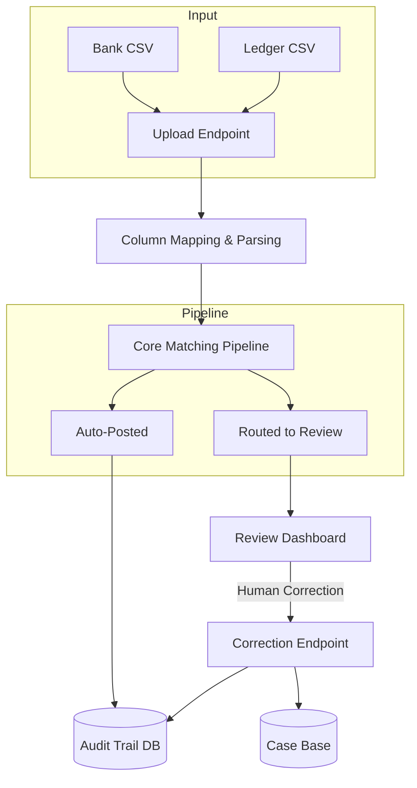
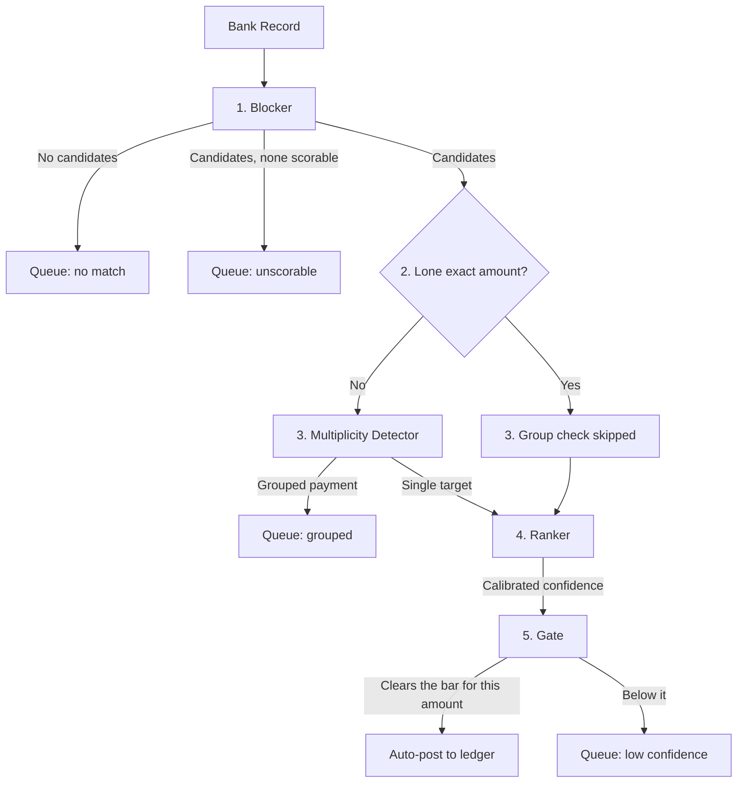
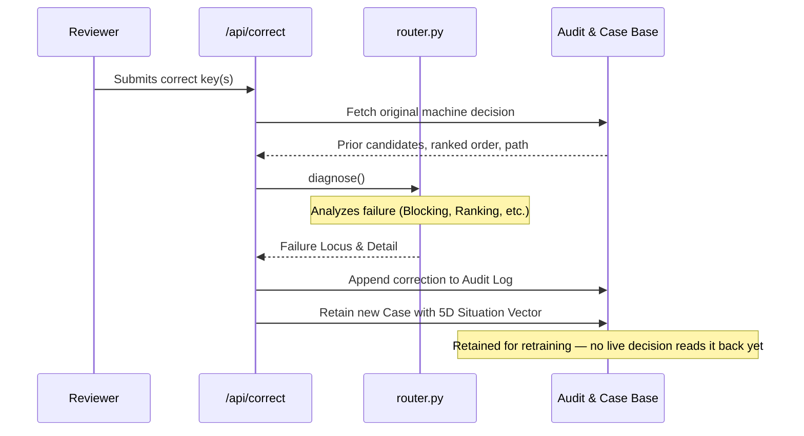
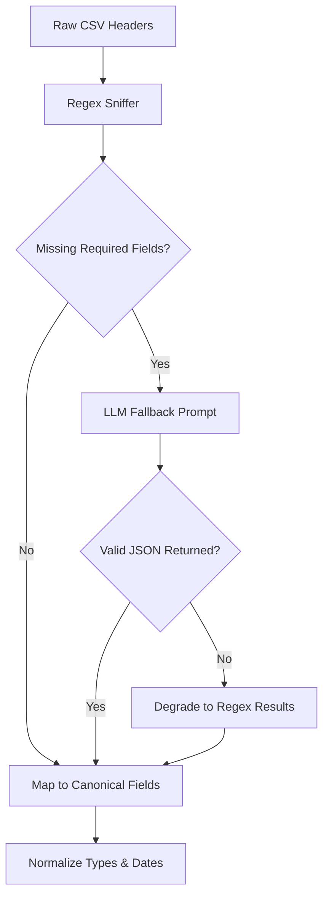

# Allocation Agent (AI Finance Controller)

**An autonomous reconciliation agent that matches bank transactions to ledger entries, detects grouped payments, and continuously learns from human corrections.**

Built for the **Razorpay Buildathon, Track 04 — AI Finance Controller**.

### 🏆 TL;DR for Judges
- **The Impact:** Automates 76.5% of reconciliation volume with **99.45% precision**, reducing manual review time by 3/4.
- **The Hard Problem:** Captures 87% of many-to-one grouped settlements (the critical gap that incumbent rules-engines completely fail to automate).
- **Agentic Learning Loop:** `/api/correct` is live: it attributes a reviewer's correction to the stage that caused it — blocking, multiplicity, ranking or threshold — because widening blocking cannot fix a ranking miss, and retains the case. The **71% cut in wrong auto-posts** is the offline retraining experiment in `scripts/run_learning.py`, run against its own controls; the live endpoint feeds that loop rather than closing it.
- **Real AI Engineering:** Zero LLMs on the critical matching path — a LightGBM LambdaRank ranker over 12 features, scored in under a millisecond, with an isotonic calibrator turning its margin into a confidence that means something. LLMs are reserved for column mapping the regex misses, and for writing the explanation after the decision is made.
- **Production Grade:** 494 passing tests, an append-only audit trail enforced by database triggers rather than convention, and every model failure degrading to human review instead of a 500.

---

## Architecture



### Core Matching Pipeline



Two things in that order are load-bearing. **The group check runs before the
ranker**, so a record that looks grouped is never given a single match to
argue about. And **a lone exact-amount candidate skips the group check**: on
that subpopulation the detector fires 41 times and is wrong on 36, so an entry
accounting for the whole amount is not allowed to be overruled by it.

---

## The finding this is built on

The data is [BenchRec](https://www.kaggle.com/datasets/benchmarkteam/benchrec-real-world-cash-reconciliation-dataset): 223,937 rows covering 172,023 reconciliations of obfuscated ledger and bank records, released from a **Tier-1 financial institution's production system**. The labels are decisions real analysts made about real money.

Split those reconciliations by shape and one number stands out:

| Match shape | Count | Resolved automatically |
|---|---|---|
| one-to-one | 153,557 | **94%** |
| many-to-one | 11,692 | 34% |
| one-to-many | 3,911 | **0%** |
| many-to-many | 2,707 | **0%** |

Their rules engine handled almost every simple match and **none** of the grouped ones. Not few — none. All 6,618 went to a person, and the data says so directly: every one carries `matchRule == MANUAL`.

That is the gap this fills.

---

## What stops it being wrong

Reconciliation fails expensively in one direction. A missed match costs a
reviewer ten minutes; a wrong auto-post writes a false claim into the ledger,
balances, and looks clean. Every guard below exists because that asymmetry
makes "usually right" the wrong target — and each one is enforced by code with
a test, not asserted in a comment.

| Claim | What enforces it |
|---|---|
| The model never sees how a match was resolved | Four outcome columns are refused at load, and a leakage gate raises inside training before a model can reach disk — including a mutual-information check for a label renamed into a feature |
| No part of a match sits on both sides of the split | The split is by time *and* keeps a settlement's records together |
| Confidence means what it says | An isotonic calibrator fitted on validation. `sigmoid(margin)` claimed 74.8% where the truth was 21.5%; the gate compares against 0.85 |
| Bigger amounts must clear a higher bar | The threshold rises with `log10` of the amount — 0.90 posts at 10,000 and queues at 1,000,000 |
| Two equally good answers are never guessed between | Any rival subset of the same size must omit a member of the one found, so dropping each in turn is a *complete* uniqueness test |
| A model failure cannot post anything | Ranker, detector, calibrator and narrator were each made to fail on purpose. All four degrade to review; the batch continues |
| Explanation cannot change a decision | Narration runs after the gate. A narrator that raises loses its sentence, not the decision |
| No invented figure reaches a reviewer | Every number in generated text must equal one the record carries, compared by value. A lying backend falls back to the template |
| Every decision is recorded, and a broken run says so | Append-only enforced by database triggers; a run that stops halfway is marked `failed` rather than left looking finished, and a run that ends is committed and marked `completed` — the batch path did neither until a test read the log back through a second connection |
| Money never drifts | Integer minor units throughout. Three decimals are refused, not rounded; a semicolon file's decimal comma is read as a decimal comma |

Nine failure modes were attacked deliberately. **One real defect surfaced** —
the explanation layer could crash a decision the gate had already made — and it
was isolated so explanation failure can no longer touch matching.

---

## Results

Held-out temporal split, test frozen, models trained on earlier records only.

### Matching

| | |
|---|---|
| blocking recall | **98.94%** — the ceiling on everything downstream |
| top-1 accuracy | **93.53%** |
| trivial baseline | 90.63% (exact amount, tiebreak nearest date) |

### End-to-end, 37,398 records

Running `artifacts/models.pkl` — the bundle that serves traffic — over the
held-out split. Regenerate with `uv run python scripts/run_batch.py`.

| | |
|---|---|
| straight-through rate | 76.5% |
| **precision of auto-posted matches** | **99.45%** (28,441 / 28,599) |
| wrong auto-posts | 158 |
| grouped records routed to review | 87.0% (3,309 / 3,804) |
| single-key records wrongly routed | 1,467 |
| throughput | **795 rec/sec** on a laptop (8-core arm64); **45/sec** on free-tier hosting, which is a fraction of a CPU. Both are the median of three warm runs |
| **LLM calls on the matching path** | **0** |
| records unaccounted for | **0** |

Review volume falls from 37,398 records to 8,799 — a **76.5% reduction in what a human must look at.**

An earlier version of this table said 79.3% and 99.2%. That was
`sigmoid(margin)`, which the service stopped using when the isotonic
calibrator shipped, and it is the flattering of the two. The script meant to
regenerate these figures had been raising `TypeError` before it reached the
matching loop, so nothing caught the drift — the numbers were correct when
written and no longer described what ran.

### Against the rules engine that produced these labels

The comparison this README was missing, and the first one anyone evaluating a
reconciliation tool asks for. BenchRec's labels *are* a Tier-1 bank's
production system deciding: `matchRule == MANUAL` marks every reconciliation a
person had to touch, so the incumbent's own auto-resolution rate is computable
on exactly this population.

| | held-out records |
|---|---|
| incumbent rules engine auto-resolved | **81.31%** |
| this system posted | **76.47%** |
| | **−4.84 pp** |

**It posts less than the engine it was built to improve on.** Split by what
that engine already managed, the aggregate turns out to cover two different
problems:

| population | n | this system posts | of those, correct | wrong |
|---|---|---|---|---|
| incumbent auto-resolved it | 30,408 | 90.04% | 27,379 / 27,380 | **1** |
| **incumbent sent it to a human** — the gap | **6,990** | **17.44%** | 1,062 / 1,219 | **157** |

On the easy population it reproduces the incumbent almost exactly and posts 90%
of it. On the hard one — the reason this project exists — it resolves one
record in six and is wrong on one in eight of those. **157 of the 158 wrong
auto-posts come from that second group.**

The first row is written as a fraction because the rate is 99.9963%, and
rounding it to 100.00% would hide the one wrong post in it.

Two things that near-perfect first row does not mean. The labels for
auto-resolved reconciliations are the incumbent's own output and the ranker
trained on that distribution, so agreeing with it is close to tautological —
the figure measures reproduction, not correctness. And the incumbent's error
rate is not measurable here at all, because its decisions define the ground
truth. What can be said is narrow and worth saying anyway: this posts 4.84 pp
less than the incumbent, and takes on a population the incumbent automated
none of.

### The learning loop



Cold start on 3,000 records, then learning from what a reviewer says. Ten batches of 4,000, all controls run.

| arm | autonomy | precision | **wrong auto-posts** |
|---|---|---|---|
| no learning | 82.1% | 97.3% | 2.22% |
| corrections only | 79.0% | 99.4% | 0.47% |
| **+ spot-check 25%** | **81.4%** | **99.2%** | **0.65%  (−71%)** |
| placebo (control) | 39.9% | 73.7% | 10.49% |

**The loop cuts wrong auto-posts by 71% at a cost of 0.7 pp of straight-through rate.** On a 4,000-record batch that is 89 wrong posts falling to 26.

It does not make the agent post *more* — it makes it post *better*, which is the right direction when a wrong match writes a false claim into the ledger and a missed one costs ten minutes of review.

Getting here required discovering that autonomy alone is a gameable metric: feeding the loop deliberately wrong answers *improved* it, because posting is gated on score margin and easy examples widen margins regardless of correctness. That is in [`BUILD_JOURNAL.md`](BUILD_JOURNAL.md).

### Multiplicity detection — the 11.3% nobody automates

**At the threshold the system actually runs** (0.7), on the held-out split:

| | precision | recall | F1 |
|---|---|---|---|
| **shipped operating point** | **68.4%** | **87.3%** | **0.767** |
| threshold 0.5 | 57.6% | 93.2% | 0.712 |
| threshold 0.3 | 42.1% | 97.4% | 0.588 |

Confusion matrix at 0.7: 3,319 grouped records caught, 485 missed, and **1,535 single-key records wrongly sent for review**. Roughly one in three of its alerts is a false alarm — the cost of catching 87% of the ones nobody else automates.

That is the detector measured on its own (`scripts/model_diagnostics.py`). In
the pipeline it catches 3,309 and wrongly routes 1,467, because `match_one`
does not let it fire on a record with a lone exact-amount candidate — on that
subpopulation it is right 12.2% of the time. The end-to-end table above
reports the pipeline figures; both are stated because they answer different
questions, and quoting the kinder one for whichever is being asked would be
the whole problem.

Ranked by confidence instead of thresholded, it looks better, and this is the number an earlier version of this README led with:

| flag top | precision | recall |
|---|---|---|
| 5% | 96.3% | 47.3% |
| 10% | 77.4% | 76.1% |
| 15% | 62.1% | 91.6% |

Both are true and the first is the honest one, because 0.7 is what runs. PR-AUC 87.2% against a 10.2% positive rate; beats the obvious rule (no exact-amount match) on F1, 76.7% vs 72.2%.

### The lone exact-amount rule, and what its number does not say

Taking the one candidate whose amount matches exactly is right **98.98%** of the
time — measured among records that had *at least four blocked candidates*. The
branch that uses that figure only fires when there is exactly **one** candidate,
a population BenchRec's held-out set contains none of, because blocking never
returns fewer than four.

So 0.9898 is an **extrapolated estimate from the nearest measured population**,
not the measured precision of the branch it governs. What the data does support
is that precision holds up as competition falls:

| candidates blocked | n | correct |
|---|---|---|
| 4-10 | 1,253 | 100.00% |
| 11-50 | 258 | 96.51% |
| 50+ | 834 | 98.20% |

And that no subgroup hides a cliff — above 100k is 100.00% (n=113) against
98.38% for 1k-10k, which inverts the usual worry. Regenerate with
`uv run python scripts/audit_direct_rule.py`.

### Is the confidence number a probability?

It was not. `confidence = sigmoid(top_score − second_score)` is a monotone
transform of a LambdaRank margin, and LambdaRank optimises *order*, not
likelihood — so neither the scores nor a sigmoid of their difference carry
probability meaning. The gate was comparing that number against 0.85.

Measured on the held-out split, what it claimed against what happened:

| claimed | actually right | records |
|---|---|---|
| 53.7% | **15.7%** | 3,685 |
| 64.5% | **15.8%** | 1,697 |
| 74.8% | **21.5%** | 996 |
| 84.9% | **46.0%** | 832 |
| 99.6% | 98.4% | 30,182 |

Overconfident by up to 53 points everywhere except the top bucket — which is
where 81% of records sit, and is why end-to-end precision looked fine while the
number itself meant nothing.

An isotonic regression fitted on **validation** and scored on **test**:

| | ECE | Brier |
|---|---|---|
| sigmoid(margin) | 0.0920 | 0.0774 |
| Platt | 0.0158 | 0.0419 |
| **isotonic (shipped)** | **0.0116** | **0.0407** |

It costs straight-through, and that is the correct direction:

| | posted | wrong | precision | straight-through |
|---|---|---|---|---|
| sigmoid(margin) | 3,176 | 22 | 99.31% | 79.40% |
| isotonic | 3,074 | **17** | **99.45%** | 76.85% |

**−2.55pp of straight-through for 23% fewer wrong auto-posts.** The 102 records
it stopped posting were 95% correct, so in hindsight posting them was fine — the
point is that the system had no way to know that, because it was posting on a
number that did not mean anything. Regenerate with
`uv run python scripts/calibrate_ranker.py`.

The gate's thresholds were tuned against the old scale and have not been
re-tuned. That should happen on validation, not on the split these figures come
from.

### Is either model overfitting?

Same temporal split, comparing what each model scores on data it was fitted on against data it was not:

| model | train | val | test | gap |
|---|---|---|---|---|
| ranker, top-1 | 97.99% | 95.56% | 96.08% | **+1.91 pp** |
| detector, PR-AUC | 0.900 | 0.849 | 0.872 | **+0.028** |

Neither is memorising. Val sits slightly below test for both, which is the temporal split doing its job rather than a bug — the validation window is a different fortnight of the bank's year, not a random sample of the same one.

One caveat on that table: those top-1 figures cap candidates at 24 per record so the three splits are measured under identical conditions. Against the full candidate set the test figure is **93.60%**, which is the number quoted above and the one the system delivers. Regenerate all of it with `uv run python scripts/model_diagnostics.py`.

---

## What is *not* an LLM, and why

| Stage | Kind | Reason |
|---|---|---|
| blocking | rules | a hash lookup; a model would be slower and worse |
| ranking | gradient-boosted trees | 169,168 labelled examples exist. That is supervised learning. |
| multiplicity | gradient-boosted trees | same |
| gate | rules | anything deciding where money goes must be reproducible |
| residual diagnosis | **arithmetic** | each cause predicts a residual; rank by fit |
| column mapping | **regex first, LLM for the rest** | regex names the common headers; the model is asked only about the ones left, and only if a key is configured. Its answer is rejected unless it names columns the file actually has |
| narration | **LLM** | language is where the ambiguity is |



**The model ranks. The engine decides. The person commits.**

**And it declines to guess.** Where two ledger keys carry identical amounts in
the same account and window, no feature can separate them: the model scores them
equally, the margin is zero, confidence is exactly 50%, and the record goes to a
human. Breaking that tie arbitrarily would post a wrong match with false
confidence on half of them.

Two constraints hold that in place:

- **The narrator may not introduce a number.** Every figure in generated text must appear in the input payload, checked after generation. There is a test that feeds it a lying backend and asserts the invented figure never reaches output.
- **The audit log is append-only, enforced by the database.** SQLite triggers reject `UPDATE` and `DELETE` on decisions. A reviewer overturning a decision writes a *new* row; both stay visible.

---

## What broke

The full account is in [`BUILD_JOURNAL.md`](BUILD_JOURNAL.md), written as it happened. Three that mattered:

**I nearly recorded a working learning loop as a failure.** It appeared to cost 3.15 pp of autonomy, reproducing under three shuffled orderings. Then the placebo control improved by 3.72 pp — feeding deliberately wrong answers made autonomy go *up*. That exposed the metric: posting is gated on score margin, easy examples widen margins, so autonomy measures *decisiveness*, not correctness. Adding precision to every arm inverted the conclusion — the loop trades 0.7 pp of straight-through for **71% fewer wrong auto-posts**.

**I nearly built blocking on a false assumption.** First measurement said amount was useless as a signal — 29% exact match, median residual 6.2 million. Wrong: I was comparing one bank record against the sum of *every* ledger row sharing a key, and a key can span 624 rows. Measured properly, **90.9% of records match some individual row to the paisa.**

**Graceful degradation got demonstrated by accident.** The LLM model I first configured does not exist — 404. I found out not from an error but because the narrator quietly produced complete, correct output and I checked why `source` said `template`. The batch finished; every exception got an accurate cause; nothing failed.

---

## Limitations

Stated plainly, because the alternative is being asked about them.

**The identity layer cannot be evaluated on this data.** `orderingPartyInfo` and `receivingPartyInfo` are **0% populated** — there are no counterparty names at all. So the five-layer resolver and transitive alias clustering in the design have nothing to run on here.

**Direction is not a usable constraint here.** `debitOrCredit` has one distinct value (`NONE`) across all 211,744 ledger rows. The design treats direction as a hard constraint, following a published post-mortem; there is nothing to constrain.

**1.06% of records are lost at blocking** and cannot be recovered downstream. Widening the window to ±14 days recovers 0.4% of that for double the candidates.

**158 auto-posted matches are wrong.** That is what 99.45% precision leaves. Each closes a real exception and writes a false claim into the ledger. **157 of the 158 are records the incumbent rules engine had sent to a human** — the population this is built for is also the only one it gets wrong.

**1,467 single-key records were wrongly sent for review** — 3.9% of the batch doing unnecessary work, the false-positive cost of catching 87.0% of the grouped ones.

**Straight-through is below the incumbent, and below vendor claims.** The rules engine that produced these labels auto-resolved 81.31% of this same held-out set; this posts 76.47%. HighRadius publishes 95–98% auto-match. Part of the vendor gap is definitional — routing a grouped record to a human counts against us and may not count against them — but that excuse does not apply to the incumbent comparison, where `matchRule == MANUAL` means a person touched it, which is exactly what routing to review means here.

**Throughput is about 1.9× the published commercial figure** — and that is on a laptop. On the free-tier host the live demo runs at 45 rec/sec, roughly 18× slower, because the instance is a fraction of a CPU. Blocking alone does 6,720/sec; the pipeline is still a per-record Python loop. A throughput number without the machine attached is not a number.

**The grouped-settlement numbers come from synthetic data.** BenchRec has no subset-sum structure — measured, not assumed: 0 of 4,000 grouped records form a closed batch, because `matchId` is a batch identifier rather than an accounting unit. So the solver is evaluated on [ReconRiver](https://huggingface.co/datasets/heybadrinath/reconriver-synthetic-reconciliation), which does have it. Synthetic amounts are drawn independently, which likely makes coincidental subsets *rarer* than in production — so 96.6% precision should be read as an upper bound, not a forecast.

**[APEX-Accounting](https://huggingface.co/datasets/sadcasticme/apex-accounting) was not used.** It is 10 developer tasks scored by rubric, not a labelled reconciliation set — a good benchmark for a coding agent and the wrong shape for measuring match precision against ground truth. Named here because it is the obvious dataset to ask about.

**It is a single-tenant demo, and the limits are the demo's not the design's.**
Uploads are capped at 10 MB, 20,000 bank rows and 100,000 ledger rows, and the
whole file is read into memory before parsing — a handful of concurrent large
uploads would evict the container. The blocking index is a Python `defaultdict`
of sets, which is fast at this size and would cost gigabytes at millions of
ledger rows. `/api/reconcile` has no authentication and no rate limit, and its
matching is CPU-bound, so repeated large uploads would starve the instance.
None of that is load-bearing for the reconciliation logic — it is the API layer
assuming one user at a time, which for a judged demo it has. At real volume the
index belongs in a store rather than a dict, parsing should stream, and the
heavy work belongs on a queue behind a rate limit.

**The audit log does not survive a redeploy on the free tier.** `runs.db` is
excluded from git and from the image, and the free instance's disk is
ephemeral, so every deploy starts with an empty log and a spin-down discards
it. Within a session the guarantees hold — append-only enforced by the
database, a `failed` status on a run that stops halfway — but the trail is
minutes old, not permanent. `AUDIT_DB` points it at a mounted volume or another
path without a code change, and `/api/health` reports `audit_persistent` so the
distinction is visible rather than assumed. Concurrency is not the issue people
expect: the container runs a single worker and the log is already
thread-safe with a lock and a four-thread test.

**And it is not small.** Each decision records the ranked candidate order,
because without it a correction cannot be attributed to a stage — a key that
was never offered is indistinguishable from one ranked second. That is a median
of 22 keys and ~870 bytes per row, against ~60 before, so a full 37,398-record
batch writes about 56 MB. Fine for a demo and for the offline runs; at real
volume the ranking belongs in its own table, truncated on a retention policy,
rather than inline in every decision's evidence.

**The offline batch was writing none of it.** `pipeline.run_batch` never called
`commit()` or `finish_run()` — only the API path did — so a 37,398-record run
built its whole trail inside an open transaction that the process threw away on
exit, and left its `runs` row at `status='running'` for a batch that had
finished. The script printed *audit rows written: 37,398* from the same
uncommitted connection, so it read as working. Three orphaned `running` rows
and no decisions in `data/audit.db` is what actually surfaced it.

**The free LLM's prose is worse than the templates it replaces.** The architecture is sound; the output is not yet an improvement. Templates are the default and the model is the optional upgrade — the reverse of what the design assumed.

**Retraining is an offline experiment, not a live feature.** `scripts/run_learning.py` produces the −71% result above with all its controls, and it is real. `POST /api/correct` now records a correction, attributes it to the stage that failed, and retains it as precedent — but it retrains nothing. The architecture diagram draws learning as a layer of the running system; the routing and the recording are live, the model update is still a script.

**The case base is written and never read.** `/api/correct` retains every correction and `/api/cases` reports what it holds, with near-duplicates collapsed into one precedent carrying a tally. But `retrieve()` is called by nothing outside its own tests: no decision consults a precedent, so the base changes no outcome. It is a record of what reviewers have said, not yet an input to anything.

**A correction was attributed to the wrong stage until recently, and permanently.** `learn/router.py` exists to keep four fixes apart — widening the window cannot repair a ranking miss, and retraining the ranker cannot repair a key it never saw. All five values `/api/correct` fed it were wrong, and each failed in the direction that looks like a ranking error: the correct key was added to the candidate set before asking whether the set contained it, so `blocking` was unreachable; the trail held one ranked key, so every ranking correction recorded `position None`; `truly_multiple` was hardcoded `False`, so a reviewer confirming a grouping was told the record maps to a single key; `routed_multiple` and `posted` each compared against a string the log does not contain, so both were always `False`. The log is append-only, so every one of those attributions is still in it. The inputs are now taken from the recorded ranking, a reviewer can name several keys, and where the trail cannot say what was offered the answer is `unattributed` rather than a guess.

---

## Connect your own Razorpay data

Test-mode keys only. `GET /v1/settlements/recon/combined` returns every settled
line with the `settlement_id` it was paid out under — so grouped, a merchant's
own account contains exactly this project's hard case: several captured
payments arriving as one bank credit.

**The settlement id is withheld from the solver.** It gets the credit and the
period's payment pool and has to recover the subset, which is the same contract
the synthetic set runs under — so recovering a real batch is a measurement, not
a lookup. There is a test asserting the id never reaches `solve_subset`, checked
on the arguments rather than by grepping the source.

A live key is refused with a reason: it would authorise reads against real
settled money and nothing here needs that. The secret is used for one request
to `api.razorpay.com` and is never stored, logged, or returned — also tested.

## Live demo

Deployed on Render's free tier. The first request after a period of inactivity
takes ~50 seconds to wake the container; subsequent ones are immediate. The
instance is a fraction of a CPU, so throughput there is 45 rec/sec against 795
on a laptop — same code, different hardware.

The demo runs on **held-out records the models never saw during training**, so
the precision it reports is measured against ground truth rather than asserted.

## Running it

```bash
uv venv && uv pip install -e ".[dev]"
uv run pytest                              # the suite prints its own count

uv run python scripts/measure_blocking.py  # recall/size tradeoff
uv run python scripts/train_ranker.py      # top-1 vs baselines
uv run python scripts/train_multiplicity.py
uv run python scripts/run_batch.py         # end-to-end + audit trail
uv run python scripts/run_learning.py      # learning loop + all controls
uv run python scripts/eval_solver.py       # group solver on ReconRiver
```

### Grouped settlements

One bank credit, many payments. The solver gets the amount and a pool of ~100
candidate payments and must recover which subset produced it -- **the batch
identifier is never passed to it**. Evaluated on ReconRiver, whose settlement
structure BenchRec does not have (measured; see the journal).

| variant | coverage | precision | balanced-but-wrong | ties refused |
|---|---|---|---|---|
| reachability DP, first subset | 38.0% | 39.0% | 59.3% | -- |
| smallest subset | 83.3% | 93.3% | 6.0% | -- |
| smallest, refuse ties | 75.3% | 96.6% | 2.7% | 11.3% |
| + cap the answer at 3 payments (shipped) | **75.3%** | **98.3%** | **1.3%** | 9.3% |

`coverage` = credits whose recorded batch it recovered. `precision` = of the
answers it gave, how many were the recorded batch. Reporting either alone is how
a solver looks good and is not: the first row answers plenty and is wrong more
often than right.

The shipped variant gives up 8pp of coverage to cut wrong answers by half. A
credit it refuses goes to a reviewer; a credit it gets wrong balances the books
against the wrong invoices, which is the more expensive of the two.

Split by how many payments the batch really had, that aggregate turns out to
cover two different problems:

| true batch | credits | recovered | wrong | ties refused | unresolved | unreachable |
|---|---|---|---|---|---|---|
| 1 payment | 30 | 7 | **4** | 3 | 16 | 21 |
| 2 payments | 62 | **62** | 0 | 0 | 0 | 0 |
| 3 payments | 58 | 44 | 0 | 14 | 0 | 0 |

**On genuine multi-payment batches: 106 of 120 recovered, zero wrong.** Every
wrong answer is a single-payment credit — an exact match that should never have
reached a subset-sum solver, and for 21 of the 30 the true payment was not in
the candidate pool at all. `unreachable` is reported separately because that is
a blocking limit, not a solver one.

```

uv run uvicorn allocation_agent.api:create_app --factory --reload   # the service
```

Everything runs on CPU. No GPU, no external services required — the LLM layer is optional and falls back to templates without a key.

```bash
cp .env.example .env    # optional: add an OpenRouter key for narration
```

---

## Design

[`docs/DESIGN.md`](docs/DESIGN.md) — HLD and LLD, including the parts not yet built and the decisions still open.

Where the code and the design disagree, the journal explains which measurement changed my mind.
