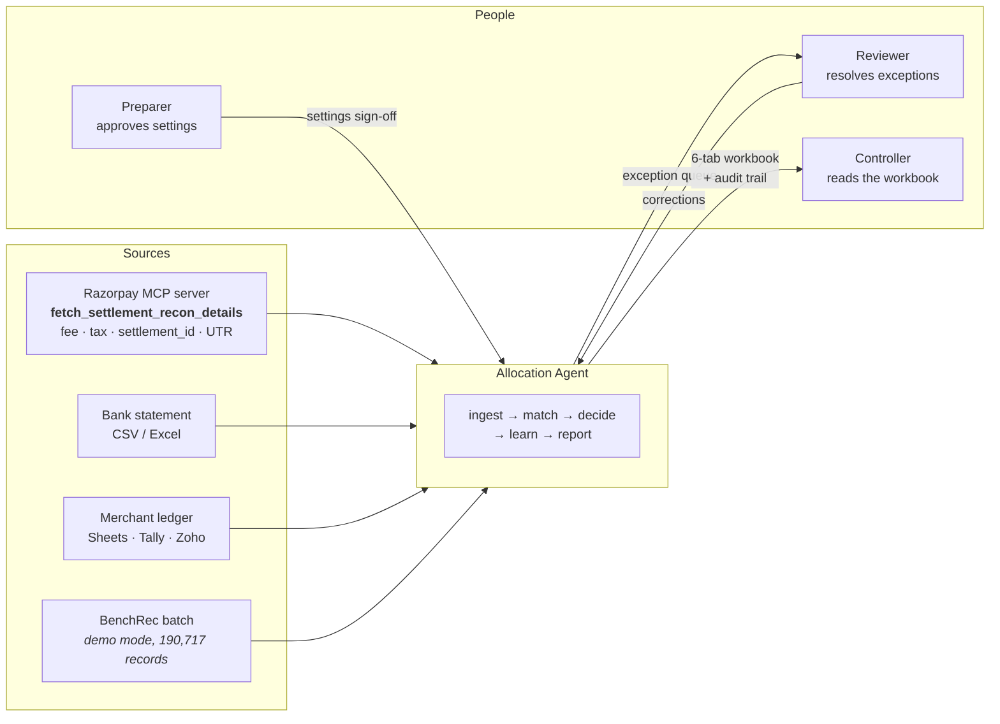
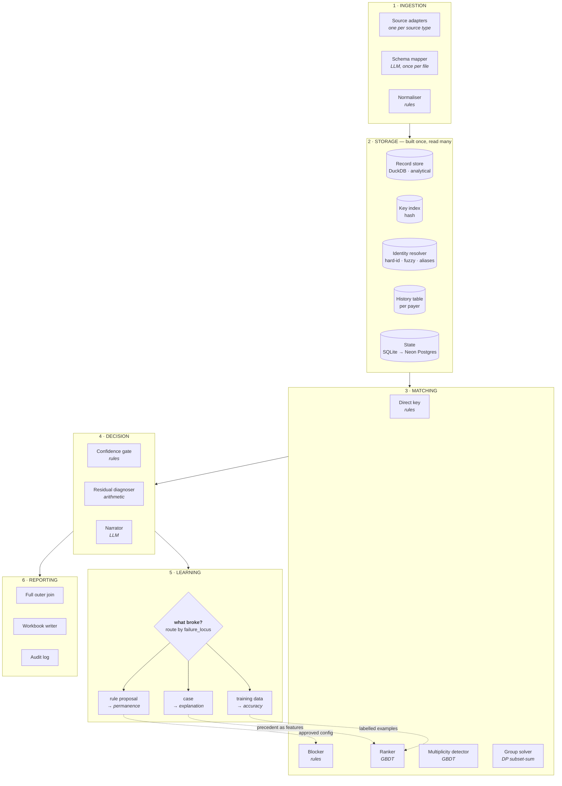
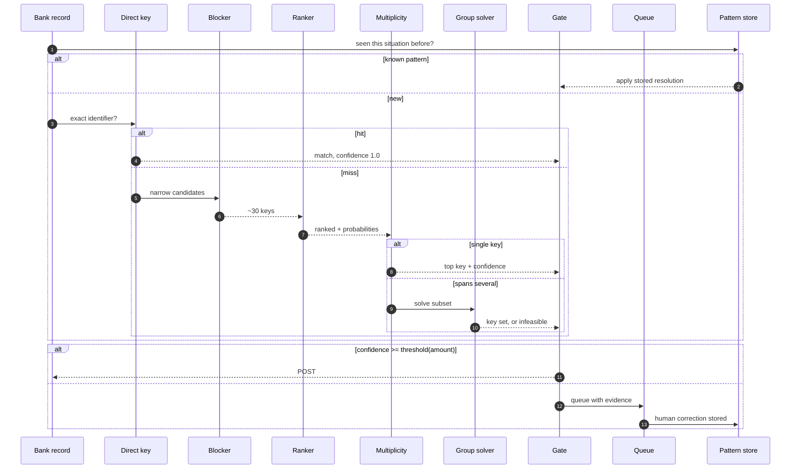
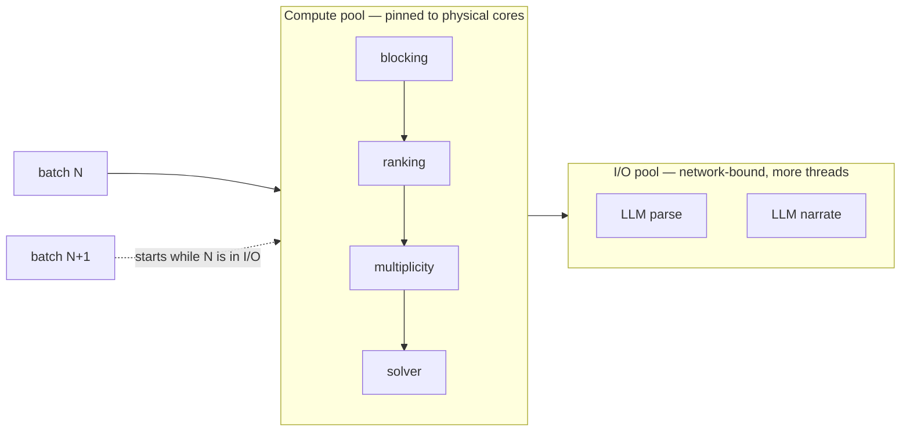
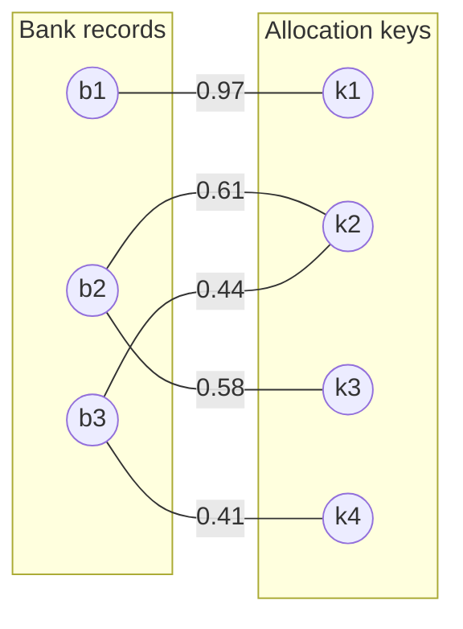
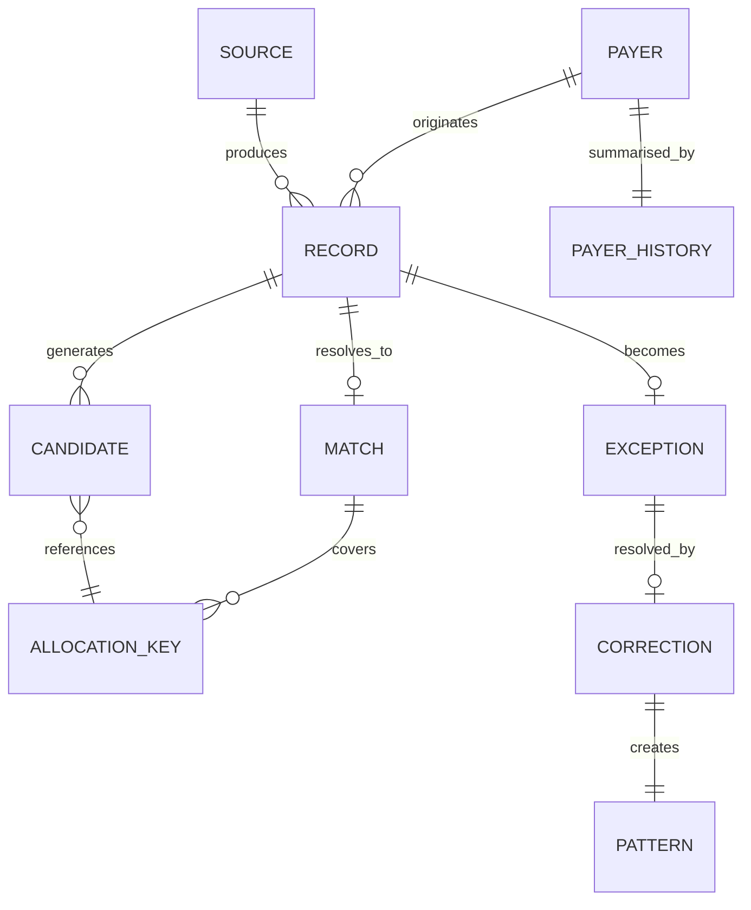

# Allocation Agent — Design Document

**Version** 0.6 (draft, for review)
**Purpose** Match bank records to ledger allocation keys, detect when one record spans several, learn from human corrections.

---

# PART A — HIGH LEVEL DESIGN

## A1. System context



## A2. Component architecture



## A3. Component responsibilities

| # | Component | Kind | Responsibility | Never does |
|---|---|---|---|---|
| 1.1 | Source adapters | rules | Pull records from one source type, emit raw rows | Interpret meaning |
| 1.2 | Schema mapper | **LLM** | Map arbitrary column names → canonical schema | Convert values |
| 1.3 | Normaliser | rules | Types, integer paise, `MISSING` markers | Guess at absent data |
| 2.1 | Record store | store | All records, all sources, queryable | — |
| 2.2 | Key index | store | Allocation keys hashed by blocking key | — |
| 2.3 | Identity resolver | store + **LLM** | Resolve counterparty identity across 5 layers | Merge entities on fuzzy evidence alone |
| 2.4 | History table | store | Per-payer aggregates | — |
| 2.5 | State store | store | Cases, aliases, training queue, audit log | — |
| 3.1 | Direct key | rules | Exact identifier match | Fuzzy anything |
| 3.2 | Blocker | rules | Cut candidate space ~3400× | Score or rank |
| 3.3 | Ranker | **GBDT** | Score candidates, calibrated probability | Commit a match |
| 3.4 | Multiplicity detector | **GBDT** | Binary: one key or several | Decide which keys |
| 3.5 | Group solver | rules | Find subset summing to target | Approximate |
| 4.1 | Confidence gate | rules | Post / queue, threshold scaled by amount | Override on model confidence alone |
| 4.2 | Residual diagnoser | rules | Compute what each cause predicts, rank by fit | Guess |
| 4.3 | Narrator | **LLM** | Write the explanation | Introduce a number |
| 5.1 | Exception router | rules | Record **which component failed**; route the correction to the right fix | Send everything to one store |
| 5.2 | Case base | store | Precedent a reviewer can read — *explanation* | Auto-commit on precedent alone |
| 5.3 | Training queue | rules | Labelled corrections → scorer refits — *accuracy* | Update mid-run |
| 5.4 | Rule proposer | rules | Systematic pattern → config change — *permanence* | Apply without approval |
| 6.x | Reporting | rules | Workbook, audit, archive | Drop a record |

## A4. Technology choices

| Layer | Choice | Why | Alternatives considered |
|---|---|---|---|
| Language | Python 3.11+ | ML ecosystem; matches the ML org's stack | — |
| Analytical / dev | **DuckDB** | Reads the 58 MB CSV instantly; per-payer aggregates are a genuine columnar scan | pandas (slower), Polars (fine too) |
| Hot path | **In-memory dicts + hnswlib** | ~100 ns lookup. **No database on the matching path at all.** | Redis — 10,000× slower per lookup and burns a free tier in 3 runs |
| Persistent state | **SQLite** local → **Neon Postgres** deployed | Patterns, cases, aliases, audit log are transactional writes that must survive restarts | DuckDB (single-writer, breaks on concurrent users) · Supabase (pauses after 1 week idle) · Render (expires at 30 days) |
| Cache | **none** | A process-local dict does the job free | Upstash Redis only if multi-worker; never on the hot path |
| Ranker | **LightGBM** or XGBoost | Tabular SOTA at this size | Tabular transformer — benchmarked as an experiment, see C3 |
| Vector index | **hnswlib**, in-process | Same algorithm a vector DB runs, minus a server and a network hop | Pinecone / Qdrant — adds ~1 ms round trip to a 100 ns lookup |
| Graph algorithms | **networkx / scipy.sparse**, in-process | Connected components on 190k nodes takes milliseconds | Neo4j — right model, wrong infrastructure at this scale (see A9) |
| Documents | **PyMuPDF** for digital PDFs only | Digital PDFs keep cell boundaries and coordinates; extraction is near-perfect | OCR for scans — probabilistic, destroys table structure, routed to exceptions instead |
| Embeddings | sentence-transformers, small model | Runs on CPU | API embeddings — cost, latency |
| LLM | Small model for parsing, larger for narration | Tiered routing; cost | Uniform — 2.7× more expensive in published cases |
| Structured output | Constrained decoding / JSON schema | 100% valid vs 95–99% for function calling | Prompt + parse (80–95%) |
| API | FastAPI | Standard, async | Flask |
| Connectors | **`razorpay/razorpay-mcp-server`** (official, 35+ tools, remote-hosted) | `fetch_settlement_recon_details` returns the recon report directly; using their own tooling beats reimplementing it | Custom adapters — more work, weaker signal |
| Bank identity | **`razorpay/ifsc`** (392★) | Real IFSC database for layer-0 hard identifiers | manual lookup table |
| Dashboard | **`razorpay/blade`** — Razorpay's own design system (647★) | Looks native to their dashboard. Nobody else will do this. | Streamlit if time runs out |
| Hosting | **Vercel** (frontend) + **Fly.io / Render** (API) + **Neon** (state) | All free tier; Neon scales to zero rather than expiring | — |

## A5. Runtime flow — one record



## A6. Execution model



**Rules**
- Processes in compute pool ≤ physical cores. Memory bandwidth saturates ~4/socket.
- No GPU anywhere.
- Batches pipelined: neither pool idles.
- LLM never on the matching path.

## A7. Non-functional targets

| Property | Target | Rationale |
|---|---|---|
| Throughput | > 417 records/sec | Beats published commercial figure |
| Determinism | Byte-identical re-run | Auditability |
| Cost on matching path | ₹0 | Zero LLM calls there |
| Memory | < 8 GB | Runs on a laptop |
| Failure mode | Degrade to rules, never halt | "AI can fail, the system cannot" |
| Demo availability | Live weeks after submission | Judges open the link during shortlisting, not on submission day |
| Concurrency | 2+ simultaneous users without corruption | Postgres for state, never DuckDB |

## A10. Key-value store — the decision rule

Not used. Here is the reasoning, so it can be revisited rather than re-argued.

### What a KV store is actually for

Sharing state **between processes that cannot see each other's memory**. That is the only
problem it solves. It is not a speed-up over local memory — it is strictly slower.

| Access | Latency |
|---|---|
| Python dict | **~100 ns** |
| Redis, same host | ~200 µs |
| Redis, managed / network | **~1 ms** |

Putting a lookup on the hot path makes it roughly **10,000× slower per call**.

### And the free tier dies immediately

```
Upstash free tier      = 500,000 commands / month
one full run           = 190,717 records × 1 lookup
                       = 190,717 commands
→ 3 runs exhausts the month
```

During a build you run the batch fifty times a day. The tier lasts under an hour.

### Where it would be legitimate

| Use | Volume | Verdict |
|---|---|---|
| Blocking / ranking / candidate lookup | 190k+ per run | **Never.** In-memory dict. |
| LLM parse cache (exceptions only) | ~10k per run | A dict already does this |
| Session state across web workers | tens per day | **Legitimate** — but Postgres or sticky sessions also solve it |
| Rate-limiting the public demo | hundreds per day | **Legitimate**, and the clearest case |

### The rule

> Add a key-value store only when **two separate processes must share mutable state**,
> and the volume is measured in **hundreds per day, not hundreds of thousands per run**.

Today: one process, 58 MB resident, nothing to share. If the deployed API ever runs on more
than one machine, revisit — for session state and rate limiting only, never for matching.

## A9. The graph formulation — and why not a graph database

Reconciliation **is** a bipartite matching problem. This is the standard formulation in the
literature: two disjoint node sets — bank statement lines on one side, ledger entries on the
other — with weighted edges where a match is plausible.



- **Edges** come from blocking — only plausible pairs get one at all
- **Weights** come from the ranker
- **A one-to-one match** is a single edge
- **A grouped match** is one node on one side joined to several on the other — a *hyperedge*,
  which is why plain bipartite matching does not express it and the subset solver exists

Three graph algorithms earn their place:

| Algorithm | Used for | Cost at 190k nodes |
|---|---|---|
| **Connected components** | Entity resolution — transitive alias clustering (B3.3) | milliseconds |
| **Bipartite assignment** | Choosing a globally consistent set of matches, not just greedy per-record | seconds |
| **Subset-sum (DP)** | Grouped matches, where an edge spans several nodes | bounded, ~10% of volume |

### Why not Neo4j

The model is a graph; the *infrastructure* need not be.

| Operation | What it actually is | Best tool |
|---|---|---|
| Blocking | point lookup on a composite key | **dict** — a graph DB is slower at this |
| Fuzzy name | vector similarity | **hnswlib** — in-process |
| Alias clustering | connected components | **scipy.sparse.csgraph** — milliseconds |
| Assignment | bipartite matching | **scipy.optimize** / the DP solver |

Everything fits in memory. A graph database would add a network round trip to operations
currently measured in nanoseconds, plus a service to deploy and keep alive.

**Position to state plainly:** *we use the graph formulation and graph algorithms; we do not
use a graph database, because at 190k nodes in one process there is nothing to distribute.*

## A8. Deployment — three ways in

Judges must be able to try it without setup.

| Mode | What happens | Why it exists |
|---|---|---|
| **1 · Demo** | Loads the BenchRec batch immediately. No signup, no key. | What most people will click. Must work in one tap. |
| **2 · Bring your own key** | Paste a Razorpay **test-mode** key → pulls live settlement recon via MCP → reconciles their own data | The moment that lands: their numbers, their account |
| **3 · Upload** | CSV / Excel of ledger + bank | For anyone with their own files |

**Security rule, non-negotiable:** validate the key prefix is `rzp_test_` and **reject a live key loudly**.
A judge pasting a production key into a hackathon project is a real risk; refusing it is itself a signal.

```
Vercel  ──  Blade frontend
   │
Fly.io  ──  FastAPI + DuckDB (per-session, in-memory)
   │
Neon    ──  Postgres: patterns, cases, aliases, audit log
```

All free tier. Neon scales to zero rather than expiring — Supabase pauses after a week idle,
Render's free Postgres expires at 30 days, and either would kill the demo exactly when a judge opens it.

---

# PART B — LOW LEVEL DESIGN

## B1. Data model



### Core schemas

```python
@dataclass(frozen=True)
class Record:
    record_id:    str            # stable, source-scoped
    source_id:    str
    side:         Literal["ledger", "bank"]
    amount_minor: int            # PAISE. never float.
    currency:     str
    value_date:   date
    account:      str
    attributes:   str | None
    references:   tuple[str, ...]
    party_name:   str | None
    raw_text:     str
    missing:      frozenset[str] # explicitly absent fields

@dataclass(frozen=True)
class AllocationKey:
    key:          str            # "USD_9/11/13_3446886485_600 cc AAB"
    currency:     str
    value_date:   date
    account:      str
    attributes:   str
    ledger_ids:   tuple[str, ...]
    total_minor:  int

@dataclass
class Candidate:
    key:          str
    features:     dict[str, float]
    score:        float | None    # set by ranker
    prob:         float | None    # calibrated

@dataclass
class Decision:
    record_id:    str
    outcome:      Literal["posted", "queued", "no_candidate"]
    keys:         tuple[str, ...]  # >1 if MULT
    confidence:   float
    threshold:    float            # what was required, given amount
    path:         Literal["pattern", "direct", "ranked", "solved"]
    evidence:     dict             # which fields agreed / disagreed
    residual_minor: int
    residual_cause: str | None
    policy_version: str
    timestamp:    datetime
```

## B2. Ingestion layer

### B2.1 Adapter interface

```python
class SourceAdapter(Protocol):
    source_id: str
    def schema(self) -> list[str]: ...
    def fetch(self, since: date | None = None) -> Iterator[dict]: ...
```

Implementations: `CsvAdapter`, `ExcelAdapter`, `SheetsAdapter`, `RazorpayAdapter`, `TallyAdapter`.

### B2.2 MCP surface

| Tool | Args | Returns |
|---|---|---|
| `list_sources` | — | `[{source_id, kind, last_sync}]` |
| `get_schema` | `source_id` | `[column names]` |
| `fetch_records` | `source_id, since?` | `[raw rows]` |
| `run_reconciliation` | `config_id` | `run_id` |
| `get_exceptions` | `run_id` | `[exception summaries]` |

### B2.3 Schema mapping (LLM — one call per source, cached)

```
in:   ["Txn Amt (INR)", "Val Dt", "A/c No", "Nrtn"]
out:  {"Txn Amt (INR)": "amount", "Val Dt": "value_date",
       "A/c No": "account", "Nrtn": "raw_text"}
```
Constrained decoding against the canonical field enum. Result cached by hash of the column list — same file shape never re-maps.

### B2.4 Normalisation rules

| Field | Rule |
|---|---|
| amount | strip `,` → Decimal → `int(x * 100)`. Reject on precision loss. |
| date | try formats in fixed order; fail loudly, never guess a century |
| account | strip, uppercase |
| references | regex extract, **expand ranges**: `INV1234-6` → `[1234,1235,1236]` |
| missing | any absent field added to `record.missing` — never defaulted to 0 or "" |

## B3. Storage layer

### B3.1 Record store (DuckDB)

```sql
CREATE TABLE records (
    record_id     VARCHAR PRIMARY KEY,
    source_id     VARCHAR,
    side          VARCHAR,
    amount_minor  BIGINT,
    currency      VARCHAR,
    value_date    DATE,
    account       VARCHAR,
    attributes    VARCHAR,
    party_name    VARCHAR,
    raw_text      VARCHAR,
    date_bucket   INTEGER,   -- days since epoch / 3
    amount_band   INTEGER    -- floor(log10(amount_minor))
);
CREATE INDEX idx_block ON records(account, date_bucket, amount_band);
```

### B3.2 Key index

```python
# blocking key -> keys
Dict[tuple[str, int, int], list[AllocationKey]]
#     account  bucket amount_band
```
O(1) lookup. Built once from the ledger side.

### B3.3 Identity resolution — five layers

Counterparty identity has **two distinct failure modes** and they need different machinery:

| Failure | Example | Similarity catches it? |
|---|---|---|
| Surface variation | `ABC Corp` / `ABC Co.` / `A.B.C. Corporation` | yes |
| Same entity, no shared text | `Zomato` / `Eternal Ltd`, `Google` / `Alphabet` | **no** |
| Different entity, near-identical text | `Reliance Industries` / `Reliance Retail` | **actively harmful** |

The third row is why more fuzziness is not the answer. The resolver runs in strict order and stops at the first hit:

```
0. HARD IDENTIFIER    GSTIN · CIN · account no · UTR   → deterministic
1. NORMALISED EXACT   casefold, strip punctuation,
                      strip Ltd/Pvt/LLP/Inc/Limited     → cheap
2. FUZZY              embeddings + HNSW                 → surface variants
3. ALIAS REGISTRY     learned entity table              → Zomato ↔ Eternal
4. LLM PROPOSAL       "same company?"                   → proposes, never commits
```

**Layer 0 is the strongest and cheapest.** In India, GSTIN and CIN are hard identity anchors. Two names sharing a GSTIN *are* the same entity — no matching required. Extract these from references and raw text before any fuzzy technique runs.

#### Name index (layer 2)
- Embed each **unique** `party_name` once (far fewer than rows)
- `hnswlib`, cosine, `M=16`, `ef_construction=200`
- Top-20 similar names → widens blocking when exact name fails

#### Alias registry (layer 3)

```sql
CREATE TABLE entities (
    entity_id      VARCHAR PRIMARY KEY,
    canonical_name VARCHAR,
    gstin          VARCHAR,      -- null if unknown
    cin            VARCHAR
);
CREATE TABLE aliases (
    alias_id       VARCHAR PRIMARY KEY,
    entity_id      VARCHAR REFERENCES entities,
    name_norm      VARCHAR,
    evidence       VARCHAR,      -- gstin|cin|cooccurrence|human|llm
    confirmations  INTEGER DEFAULT 0,
    contradictions INTEGER DEFAULT 0,
    confirmed_by   VARCHAR,
    trusted        BOOLEAN DEFAULT FALSE
);
CREATE INDEX idx_alias ON aliases(name_norm);
```

**Population, in descending order of trust:**

| Source | Mechanism | Trusted immediately? |
|---|---|---|
| `gstin` / `cin` | Shared hard identifier | **yes** |
| `human` | Reviewer confirmed a match across the two names | **yes** |
| `cooccurrence` | N successful matches linking the names | after `min_confirmations` |
| `llm` | Model asked "are these the same company?" | **never** — proposal only |

```python
def trusted(a: Alias, cfg) -> bool:
    if a.evidence in ("gstin", "cin", "human"):
        return a.contradictions == 0
    return (a.confirmations >= cfg.min_confirmations
            and a.contradictions == 0)
```

#### Transitive clustering — connected components

Aliases are **edges in a graph**, not isolated pairs. Entity resolution is standardly solved by
taking connected components: if `Zomato ~ Eternal` and `Eternal ~ Eternal Ltd`, then all three
are one entity — a conclusion pairwise storage never reaches.

```python
from scipy.sparse.csgraph import connected_components
from scipy.sparse import coo_matrix

def cluster_entities(edges, n_names, cfg):
    strong = [(i, j) for i, j, w, ev in edges
              if ev in ("gstin", "cin", "human") or w >= cfg.merge_threshold]
    adj = coo_matrix((np.ones(len(strong)),
                      zip(*strong)), shape=(n_names, n_names))
    n_ent, labels = connected_components(adj, directed=False)
    return labels          # name index -> entity_id
```

Milliseconds on 190k nodes. No graph database involved.

> **The danger, and it is real.** Transitivity chains. One bad edge merges two genuinely
> different companies, and then everything they each touch. `Reliance Industries` sits one weak
> edge away from `Reliance Retail`.

**Four guards, all necessary:**

| Guard | Rule |
|---|---|
| **Edge threshold** | Only edges above `merge_threshold` (or backed by a hard identifier / human) join a cluster. Fuzzy-only edges widen candidates but never merge. |
| **Cluster size cap** | A component exceeding `max_cluster_size` is **rejected wholesale** and queued for review — runaway merging is a bug, not a discovery. |
| **Hard-identifier conflict** | Two names with *different* GSTINs in one component ⇒ split the component and flag the weakest edge. A hard identifier always beats a similarity score. |
| **Provenance** | Every merge records which edges caused it, so any cluster can be explained and any single edge retracted without rebuilding everything. |

**Open question, to be measured not assumed (D17):** what `merge_threshold` and
`max_cluster_size` actually are. Both need tuning against the alias graph the real data
produces. Setting them by intuition is exactly how over-merging happens.

**Safety rule.** An untrusted alias may *widen the candidate set* but must not *raise confidence*. Only trusted aliases feed `name_match_strength` to the ranker. A wrongly merged entity reconciles one company's money against another's — worse than any missed match.

Any contradiction retires the alias immediately and flags it for review.

#### LLM proposal (layer 4)

Runs only on unresolved counterparties, batched, offline — never on the matching path.

```
in:  ["ETERNAL LIMITED", "Zomato Media Pvt Ltd"]
out: {same_entity: true, reason: "Zomato Ltd renamed to Eternal Ltd",
      confidence: "high"}
```
Result is written as an `llm`-evidence alias: untrusted, queued for human confirmation. This is a legitimate model use — world knowledge that is genuinely absent from the data — and it is confined to proposing.

### B3.4 History table

```sql
CREATE TABLE payer_history (
    payer_key         VARCHAR PRIMARY KEY,
    n_records         INTEGER,
    median_lag_days   REAL,
    p90_lag_days      REAL,
    usual_deduction_bps INTEGER,   -- basis points
    deduction_stability REAL,      -- 1 - CV
    mult_rate         REAL,        -- share historically MULT
    median_amount     BIGINT,
    top_keys          VARCHAR[]
);
```
**Computed once per run, before matching.** This is the difference between minutes and hours.

### B3.5 Pattern store

```sql
CREATE TABLE patterns (
    pattern_id     VARCHAR PRIMARY KEY,
    situation_hash VARCHAR,   -- see B6.2
    resolution     JSON,
    created_run    VARCHAR,
    times_applied  INTEGER,
    times_correct  INTEGER    -- for pruning bad patterns
);
CREATE INDEX idx_sit ON patterns(situation_hash);
```

## B4. Matching pipeline

### B4.1 Direct key

```python
def direct_key(rec: Record, idx: RefIndex) -> AllocationKey | None:
    for ref in rec.references:
        if (k := idx.by_reference.get(ref)):
            return k
    return None
```
Complexity O(|refs|). Confidence 1.0.

### B4.2 Blocker

```python
def block(rec, key_index, name_index, cfg) -> list[AllocationKey]:
    buckets = range(rec.date_bucket - cfg.date_slack,
                    rec.date_bucket + cfg.date_slack + 1)
    bands   = (rec.amount_band - 1, rec.amount_band, rec.amount_band + 1)
    out = []
    for b in buckets:
        for band in bands:
            out += key_index.get((rec.account, b, band), [])
    if len(out) < cfg.min_candidates and rec.party_name:
        for alias in name_index.query(rec.party_name, k=20):
            out += key_index.by_party.get(alias, [])
    return dedupe(out)
```

**Complexity** O(`date_slack` × 3) hash lookups.
**Metric** `recall@k` — measure this before anything else.
**Tuning** widen `date_slack` until recall plateaus, then stop.

### B4.3 Ranker

Feature vector per (record, candidate):

| Feature | Formula |
|---|---|
| `amount_delta_abs` | `abs(rec.amount - key.total)` |
| `amount_delta_rel` | `delta / max(rec.amount, 1)` |
| `date_gap_days` | `(rec.date - key.date).days` |
| `date_gap_vs_payer_median` | `date_gap - history.median_lag` |
| `account_exact` | `1.0 / 0.0` |
| `attr_jaccard` | token Jaccard on attributes |
| `ref_overlap` | shared references / total |
| `name_match_layer` | 0=hard id · 1=exact · 2=fuzzy · 3=trusted alias · 4=none |
| `name_cosine` | from name index (layer 2 only) |
| `entity_confirmed` | 1.0 if resolved by GSTIN/CIN/human alias |
| `payer_key_prior` | how often this payer used this key |
| `n_candidates` | shortlist size (ambiguity proxy) |
| `score_margin` | top score − second score |
| `missing_count` | `len(rec.missing)` |

```python
model = LGBMClassifier(objective="binary", n_estimators=400,
                       learning_rate=0.05, num_leaves=63)
# then:
calibrated = CalibratedClassifierCV(model, method="isotonic", cv="prefit")
```

**Training pairs** — positive: true key. Negatives: other survivors of blocking (hard negatives, not random).
**Output** calibrated `P(match)`.

### B4.4 Multiplicity detector

Separate model, **record-level** features only (no candidate):

| Feature | Note |
|---|---|
| `amount_vs_payer_median` | **strongest signal — MULT ≈ 2× median** |
| `top1_prob` | weak top score → likely MULT |
| `top1_minus_top2` | flat distribution → likely MULT |
| `n_candidates` | |
| `is_round_number` | `amount % 100000 == 0` |
| `payer_mult_rate` | from history |
| `n_references` | multiple refs → multiple keys |

```python
LGBMClassifier(scale_pos_weight = (1 - 0.108) / 0.108)
```
Report **PR-AUC**, and precision at a fixed alert budget. Not ROC-AUC — 10.8% positive.

### B4.5 Group solver

```
Problem: find S ⊆ candidates with |sum(S) − target| ≤ ε
Money is integers → pseudo-polynomial DP is genuinely polynomial here.

dp[i][s] = reachable using first i candidates, sum s
time  O(n · target/gcd)
space O(target/gcd)   -- rolling row + parent pointers for reconstruction
```

```python
def solve_subset(cands: list[int], target: int, eps: int,
                 max_n: int = 40, timeout_ms: int = 200) -> list[int] | None:
    if len(cands) > max_n:
        cands = top_by_ranker_score(cands, max_n)
    ...
```

**Guards**
- cap `n` at 40 (p99 of real instances is 72 — log and skip beyond)
- hard timeout → exception, never a partial guess
- if multiple subsets valid → return highest total ranker score, flag ambiguity

## B5. Decision layer

### B5.1 Gate

```python
def threshold_for(amount_minor: int, cfg) -> float:
    # cfg.base = 0.85, cfg.k = 0.02, cfg.cap = 0.995
    t = cfg.base + cfg.k * math.log10(max(amount_minor, 1) / 10_000)
    return min(t, cfg.cap)
```

| Amount | Threshold |
|---|---|
| ₹100 | 0.85 |
| ₹10,000 | 0.89 |
| ₹1,00,000 | 0.91 |
| ₹50,00,000 | 0.945 |

Tune `k` against **expected cost**, not accuracy. Cost of FP scales with amount; cost of FN is review time (flat).

### B5.2 Residual diagnoser (pure arithmetic)

```python
CAUSES = [
  ("BANK_CHARGE",   lambda r,h: h.usual_deduction_bps * r.amount // 10_000),
  ("ROUNDING",      lambda r,h: r.n_lines * 1),          # ≤ 1 paisa/line
  ("FX_DIFF",       lambda r,h: fx_delta(r)),
  ("PARTIAL",       lambda r,h: single_line_amount(r)),
  ("TAX_WITHHELD",  lambda r,h: r.amount * TDS_RATE // 100),
]

def diagnose(residual: int, rec, hist) -> list[tuple[str, float]]:
    return sorted(
        ((name, fit(residual, pred(rec, hist))) for name, pred in CAUSES),
        key=lambda x: -x[1]
    )
```

`fit()` = closeness of predicted residual to observed. **Diagnosis is computed, then ranked. The LLM never proposes a cause.**

### B5.3 Narrator (LLM)

```
System (cached):  role, output schema, cause enum, style rules
User (varies):    {record, matched keys, residual, ranked causes, evidence}
Output (constrained JSON): {cause: enum, sentence: str, cited_fields: [str]}
```

**Hard constraint** — post-validation: every number in `sentence` must appear in the input payload. If not → reject, log, fall back to template.

Batched 20 per call. Stable content first for prompt caching.

## B6. Learning layer

When a person fixes a mistake, two questions get answered. The first one decides everything else.

---

### B6.1 Question one — what broke?

Same symptom, four completely different causes, four completely different fixes.
**Only two of them involve a model.**

| What went wrong | `failure_locus` | The actual fix |
|---|---|---|
| The right key was never even considered | `blocking` | **Widen the search window.** A settings change. Not a model problem. |
| It was considered but scored too low | `ranking` | **Add to training data.** |
| It covered several keys and we missed that | `multiplicity` | **Add to training data.** |
| We got it right but refused to post it | `threshold` | **Propose a settings change.** |
| Counterparty not recognised | `identity` | **Record an alias.** |
| Flagged as grouped but no combination summed | `solver` | **Tolerance config.** |

Recording this on every exception is the load-bearing part of the whole layer.
Route every correction into one store and none of these lessons ever gets learned.

```python
@dataclass
class Exception_:
    record_id:     str
    failure_locus: Literal["blocking","ranking","multiplicity",
                           "solver","threshold","identity"]
    reason:        Literal["below_threshold","no_candidate","infeasible",
                           "ambiguous","timeout"]
    proposal:      Decision | None
    evidence:      dict
    margin:        float    # top1_prob - top2_prob, drives the review queue order
```

---

### B6.2 Question two — how do we remember it?

Three mechanisms. **Each does a different job.** They are not a hierarchy.

| Mechanism | Job | What it changes |
|---|---|---|
| **Save the case** | *explanation* | nothing — it is evidence a reviewer and an auditor can read |
| **Add to training data** | *accuracy* | the scorer's cutoffs, silently, on the next refit |
| **Propose a rule** | *permanence* | config, after a human approves it |

---

### B6.3 What "training" actually means here

The thing being trained is **the scorer**. Its entire job:

> Given a bank record and one candidate key — how likely is it these belong together?

It looks at six or so comparisons and returns a probability:

| Comparison | Example value |
|---|---|
| Amount difference | ₹0 |
| Days apart | 5 |
| Name similarity | 0.91 |
| Reference overlap | 2 of 3 |
| Same account | yes |
| Payer's history with this key type | frequent |

**Training = working out how much each comparison matters and where the cutoffs sit.**

From 169,168 known-correct examples it derives things like *"amount exact + under 3 days apart
+ similar name ⇒ match 98% of the time"* and *"amount off by more than ₹5,000 ⇒ almost never."*
Nobody writes those rules. They come from what actually happened.

**The correction loop, concretely.** Suppose a payer always settles 5 days late. The scorer
learned "over 3 days is suspicious" because that is what most training examples looked like,
so it refuses to post and a person fixes it — every month. Once ~200 such corrections enter
the training data and it refits, it has seen many 5- and 6-day gaps that *were* matches, and
shifts the cutoff. Not by a rule about that payer — it learns that days-apart matters less
than it thought when amount and name are both strong.

```python
model.fit(features, labels)      # ~30 seconds, CPU, a few hundred trees
```

It is the same kind of model as a spam filter, and the same mechanism: marking one email
"not spam" does not just remember that email, it shifts what the filter believes about
senders like that.

> **It is not the LLM.** No fine-tuning, no GPU, no preference pairs. The language model in
> this system never learns anything — it reads messy bank text and writes sentences, start
> to finish. Decisions are made by trees and rules, both of which refit in seconds and
> reproduce exactly.

**Rules:** refit on a schedule or after N corrections — **never mid-run**, or the run stops
being reproducible. Weight recent corrections higher; weight grouped-case corrections higher
still, since only 10.8% of records are positive and each confirmed one is scarce.

---

### B6.4 The case base — why keep it

```python
@dataclass
class Case:
    case_id:       str
    problem_vec:   np.ndarray     # embedding of the situation
    problem_feat:  dict           # payer, locus, residual band, missing fields
    solution:      Decision
    outcome:       Literal["confirmed","reverted"]
    confirmations: int
```

Retrieval is nearest-neighbour above a similarity threshold, restricted to the **same
failure locus** — a blocking failure teaches nothing about a threshold failure.

Retrieved cases do two things: enter the scorer as features (`n_similar_cases`,
`case_agreement`), and appear to the reviewer as precedent — *"a reviewer resolved this on
12 March, like this."*

> **Honest note.** Retraining alone would probably carry the accuracy. The case base earns
> its place on **explainability**: a model weight cannot answer *"why did you do that?"*, and
> a cited precedent can. If something has to be cut for time, cut this first — routing and
> retraining are the load-bearing pair.

**Selective retention**, or the base fills with noise and the autonomy curve becomes an
artefact of its size:

```python
def should_retain(case, base, cfg) -> bool:
    if base.nearest_similarity(case) > cfg.dup_threshold:   # 0.95
        base.bump_confirmation(case); return False           # count it, don't store it
    if case.human_was_uncertain:  return False               # noisy label
    if case.outcome == "reverted": base.retire_similar(case); return False
    return True
```

---

### B6.5 Rule proposal — the only one written in language

When ≥ N corrections share a locus and a feature pattern:

```
observed: 14 corrections · locus=blocking · payer=ACME* · keys 4–6 days out
proposed: date_slack 2 → 3 buckets for payer_group=ACME
impact:   +112 candidates/run · est. +0.3% recall
          [ approve ]  [ reject ]
```

A human approves and it becomes config. This is the only mechanism producing something an
auditor can read, and it fixes a whole class rather than one case at a time.

---

### B6.6 Which exceptions to ask about

Two orderings, answering different questions:

| Ordering | Basis | Purpose |
|---|---|---|
| **Must review** | amount above threshold | control — non-negotiable |
| **Worth reviewing** | **margin sampling**: smallest `top1 − top2` | learning — most information per human minute |

Least-confident is not most-informative. A record unsure across 30 candidates teaches little;
one torn between exactly two teaches where the boundary is.

---

### B6.7 Guards

- A case applied ≥3 times with accuracy < 0.9 is **retired automatically**, and the retirement
  is surfaced — a decaying case is a signal the world changed
- Case base is size-capped; retention is competitive
- **Every applied case is recorded in the audit trail by `case_id`**, so any decision traces
  back to the human decision that taught it

## B7. Reporting

Six tabs, produced by full outer join so nothing is dropped:

| Tab | Contents |
|---|---|
| 1 Matched | posted, with confidence and evidence |
| 2 Unmatched — ledger | keys with no bank record |
| 3 Unmatched — bank | records with no key |
| 4 Duplicates | flagged same-record candidates |
| 5 Low confidence | queued, with proposal and cause |
| 6 Proposed entries | draft journal entries for the residuals |

**Audit log** — one append-only row per decision, never updated:
```
run_id, record_id, timestamp, path, candidates_considered,
chosen_keys, confidence, threshold_required, policy_version,
evidence_json, human_id?, human_action?
```

## B8. Configuration (approved before run)

```yaml
run:
  id: 2026-08-21-001
  approved_by: <user>
  approved_at: <ts>
  policy_version: v0.1

blocking:
  date_slack_buckets: 2       # ×3 days
  amount_band_slack: 1
  min_candidates: 5
  name_fallback_k: 20

identity:
  strip_suffixes: [LTD, LIMITED, PVT, PRIVATE, LLP, INC, CORP]
  fuzzy_threshold: 0.82       # widens candidates
  merge_threshold: 0.94       # joins an entity cluster — MUST be tuned, not guessed
  max_cluster_size: 12        # above this, reject the component and queue for review
  min_confirmations: 3        # cooccurrence -> trusted
  llm_proposals: true         # offline, proposal-only

tolerance:
  amount_minor: 100           # ₹1.00
  date_days: 3

gate:
  base_threshold: 0.85
  amount_scaling_k: 0.02
  cap: 0.995

solver:
  max_candidates: 40
  timeout_ms: 200
  epsilon_minor: 100

learning:
  enabled: true
  # case base
  case_k: 5
  case_similarity_tau: 0.85
  dup_threshold: 0.95            # above this, bump count instead of storing
  case_base_max: 50000
  # scorer refit
  retrain_every_n_corrections: 250
  correction_weight: 2.0
  recency_halflife_days: 90
  # rule proposal
  min_corrections_for_rule: 10
  # shared guardrails
  min_applications_before_trust: 3
  retire_below_accuracy: 0.9
  # active learning
  queue_ordering: margin         # margin | entropy | least_confident
```

## B9. Module layout

```
allocation_agent/
├── adapters/        csv.py excel.py sheets.py razorpay.py  base.py
├── ingest/          mapper.py normalise.py refs.py
├── stores/          records.py keys.py names.py history.py patterns.py
│                 identity.py   ← 5-layer resolver + connected-component clustering
├── match/           direct.py blocker.py ranker.py multiplicity.py solver.py
├── decide/          gate.py residual.py narrate.py
├── learn/           router.py casebase.py training.py propose.py
│                 active.py apply.py
├── report/          workbook.py audit.py
├── eval/            splits.py leakage.py metrics.py baselines.py
│                    controls.py ablations.py
├── mcp_server.py
└── config.py

BUILD_JOURNAL.md     ← what broke, written as it happens
```

---

# PART C — EVALUATION DESIGN

## C1. Leakage guard (run first, ten minutes)

```python
FORBIDDEN = {"generatorAllocation", "matchRule", "matchedBy", "matchDate"}

def assert_no_leakage(features: pd.DataFrame):
    assert not (FORBIDDEN & set(features.columns))
    for col in features.columns:            # catch derived leaks
        assert mutual_info(features[col], y) < 0.95, f"{col} leaks"

def assert_group_split(train, test):
    assert not (set(train.matchId) & set(test.matchId))
```

## C2. Splits

```
sort by value_date
├── train  earliest 70%
├── val    next 10%      ← threshold tuning, calibration fitting
└── test   latest 20%    ← FROZEN. touched once.
```

Report both random-split and temporal-split numbers. The gap is itself a finding.

## C3. Controls on the learning claim

| Control | Method | Pass condition |
|---|---|---|
| **C-1 Ablation** | Same sequence, pattern store disabled | Gap between curves > 0 |
| **C-2 Order** | 5 shuffled orderings | Improvement in all 5 |
| **C-3 Placebo** | Random corrections into the stores | **No improvement.** If it improves, measurement is broken. |
| **C-4 Novel situations** | Hold out *situations never seen*, not just records | Improvement here proves L1–L3 generalise. Improvement only on repeats means you built a cache. |
| **C-5 Mechanism ablation** | routing only · +cases · +refit · +rules | Each should add measurable autonomy, or be dropped |

## C4. Metrics

| Component | Metric | Note |
|---|---|---|
| Blocker | `recall@k` vs candidate count | **measure first** |
| Ranker | top-1, top-5, MRR | split by cardinality class |
| Multiplicity | PR-AUC, precision @ fixed budget | not ROC-AUC |
| Calibration | ECE + reliability diagram | |
| Gate | precision & coverage at threshold | |
| Cost | FP weighted by amount | |
| Throughput | records/sec, P50/P90 by class | vs 417/sec |
| **Human cost** | `human_minutes_per_run`, tracked per run | the business number — should fall as autonomy rises |
| Learning | autonomy per batch + 3 controls | |

## C5. Failure tests

Run each, record the behaviour in `BUILD_JOURNAL.md`:

| Injected failure | Expected behaviour |
|---|---|
| LLM unavailable | matching continues; narration falls back to template |
| LLM rate-limited (429) | exponential backoff, then queue for later |
| Malformed amount / impossible date | rejected loudly at normalisation, never coerced |
| Column order changed | schema mapper handles it; cache miss, remaps |
| Prompt injection in a narration field | inert — it is data, never reaches an instruction channel |
| Pattern store corrupted | degrades to no-memory, logs, continues |
| Solver timeout | exception, never a partial guess |

## C6. Baselines

1. Random pick from candidates
2. Direct key only
3. Fuzzy match (PMI-weighted cosine — the 2012 method)
4. **The bank's own engine** (`matchRule != MANUAL`) — 0% on grouped cases

---

# PART D — OPEN DECISIONS

Things I picked a default for. Change any of these.

| # | Decision | Current | Alternatives |
|---|---|---|---|
| D1 | Ranker model | LightGBM | XGBoost · CatBoost · **tabular transformer as a benchmarked experiment** |
| D2 | Blocking strategy | account + date bucket + amount band | LSH · sorted-neighbourhood · learned blocking |
| D3 | Threshold curve | log in amount | step function · learned from cost matrix · **conformal prediction sets** |
| D4 | Situation hash fields | payer + reason + residual bucket + missing + candidate count | tighter, looser, or learned |
| D5 | Group solver cap | 40 candidates, 200ms | higher cap · ILP fallback · give up earlier |
| D6 | Multiplicity model | separate classifier | joint model with ranker · threshold on score margin only |
| D7 | Storage | DuckDB | SQLite · Postgres · Parquet + Polars |
| D8 | Dashboard | Streamlit (time) | Next.js (better demo) |
| D9 | MCP scope | 5 tools | more granular · skip entirely |
| D10 | Where the LLM sits | mapping + narration only | also investigation agent with typed tools |
| D11 | Alias trust rule | hard-id/human instant, 3 confirmations otherwise | stricter · require human always · learned threshold |
| D12 | Case similarity threshold | 0.85 cosine, same locus required | lower (more recall) · learned · locus-agnostic |
| D13 | Rule induction | propose at 10 corrections, human approves | auto-apply low-risk rules · never auto · higher bar |
| D14 | Storage split | DuckDB analytical · dicts hot path · Neon Postgres state | Postgres for everything · Polars+Parquet · all in-memory |
| D15 | Redis | **not used** | Upstash if multi-worker — but never on the hot path (500k commands/month = 3 runs) |
| D16 | Frontend | Blade (Razorpay's own system) | Streamlit if time runs short · plain Next.js |
| D17 | **Alias merge threshold + cluster cap** | 0.94 / 12 — **placeholders, must be measured** | tune on the real alias graph; over-merging is the failure mode |
| D18 | Assignment | greedy per record | global bipartite assignment for consistency — slower, avoids two records claiming one key |

---

# APPENDIX — Measured facts this design rests on

| Fact | Value | Source |
|---|---|---|
| Bank records to label | 190,717 | measured, BenchRec |
| Distinct allocation keys | 103,191 | measured |
| Records spanning several keys | 10.8% (20,521) | measured |
| Those automated by the bank's engine | **0%** | measured (`matchRule`) |
| MULT amount vs single | 12,088 vs 6,077 median | measured |
| Keys per account | median 3,540 | measured |
| Key reconstructable from 4 fields | 100% | verified on 20k sample |
| Candidate reduction from blocking | ~3,400× | computed |
| CPU share of agentic latency | up to 88% | Intel/GaTech 2026; Azure fleet 2026 |
| Commercial throughput reference | 417 rec/sec | Razorpay Recon published |
| Commercial match-rate reference | 95–98% | HighRadius published |
| Random→temporal split penalty | 0.925 → 0.537 AP | IEEE-CIS published |
| Entity rename with zero string overlap | Zomato → Eternal Ltd (2025) | real, India |
| Razorpay MCP tools available | 35+, remote-hosted | razorpay/razorpay-mcp-server |
| Settlement recon fields incl. fee, tax, settlement_id, UTR | native | Razorpay Settlement Recon API |
| Upstash Redis free tier | 500k commands/month | one full run = 190,717 commands |
| Track 04 competitor batch sizes | 61 · 63 · 2,000 records | GitHub survey, Aug 2026 |
